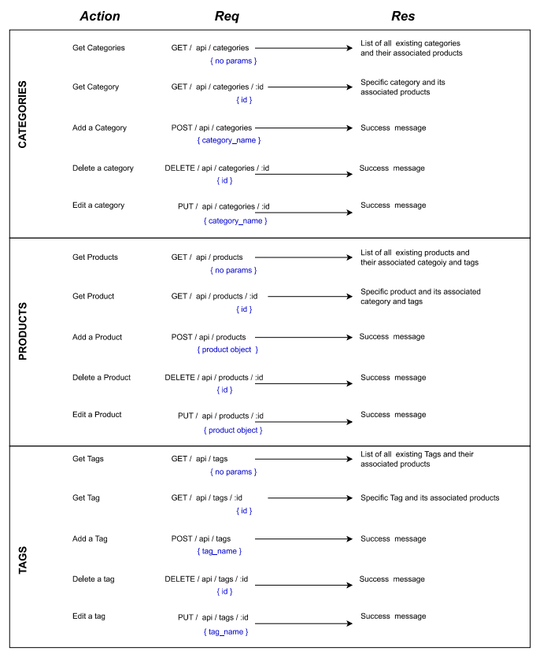

# Ecommerce backend


## Summary of the project and links

This project is about building the backend of an ecommerce app, configuring a working Express.js API to use Sequelize to interact with a MySQL database.

Github repo: [Go to Repo](https://github.com/Am0031/ecommerce-backend/tree/dev)
Demo video: [Go to Demo video]()

## Table of Contents

- [About the Project](#about-the-project)
- [Technologies](#technologies)
- [Main logic of the application](#main-logic-of-the-application)
- [Installation](#installation)
- [Demo video](#demo-video-of-the-application)
- [Contact me](#contact-me)

## About the project

### User Story

```md
AS A manager at an internet retail company
I WANT a back end for my e-commerce website that uses the latest technologies
SO THAT my company can compete with other e-commerce companies
```

### Acceptance Criteria

```md
GIVEN a functional Express.js API
WHEN I add my database name, MySQL username, and MySQL password to an environment variable file
THEN I am able to connect to a database using Sequelize
WHEN I enter schema and seed commands
THEN a development database is created and is seeded with test data
WHEN I enter the command to invoke the application
THEN my server is started and the Sequelize models are synced to the MySQL database
WHEN I open API GET routes in Insomnia for categories, products, or tags
THEN the data for each of these routes is displayed in a formatted JSON
WHEN I test API POST, PUT, and DELETE routes in Insomnia
THEN I am able to successfully create, update, and delete data in my database
```

## Technologies

For this project, the following technologies and packages were used:

- Node.js v18.2.0 and NPM v8.9.0
- Node external packages:
  - "[dotenv](https://www.npmjs.com/package/dotenv)": "^16.0.1",
  - "express": "^4.18.1",
  - "[MySQL2](https://www.npmjs.com/package/mysql2)": "^2.3.3",
  - "[Sequelize](https://www.npmjs.com/package/sequelize)": "^6.21.2"

For testing of the API calls: Postman.
You can see the Postman collection of requests by uploading [this file](./ecommerce-backend.postman_collection.json) into your postman application and testing these requests.

This Challenge will require a video submission. Refer to the [Fullstack Blog Video Submission Guide](https://coding-boot-camp.github.io/full-stack/computer-literacy/video-submission-guide) for additional guidance on creating a video.

You’ll need to use the and packages to connect your Express.js API to a MySQL database and the package to use environment variables to store sensitive data.

Use the `schema.sql` file in the `db` folder to create your database with MySQL shell commands. Use environment variables to store sensitive data like your MySQL username, password, and database name.

## Main logic of the application

### Database Models

Our database contains the following four models, including the requirements listed for each model:

- `Category`

  - `id`: Integer / Doesn't allow null values / Set as primary key / Auto increment.

  - `category_name`: String / Doesn't allow null values.

- `Product`

  - `id`: Integer / Doesn't allow null values / Set as primary key / Auto increment.

  - `product_name`: String / Doesn't allow null values.

  - `price`: Decimal / Doesn't allow null values / Validates that the value is a decimal.

  - `stock`: Integer / Doesn't allow null values / Default value of `10` / Validates that the value is numeric.

  - `category_id`: Integer / References the `Category` model's `id`.

- `Tag`

  - `id`: Integer / Doesn't allow null values / Set as primary key / Auto increment.

  - `tag_name`: String / Doesn't allow null values.

- `ProductTag`

  - `id`: Integer / Doesn't allow null values / Set as primary key / Auto increment.

  - `product_id`: Integer / References the `Product` model's `id`.

  - `tag_id`: Integer / References the `Tag` model's `id`.

### Associations

Our associations are:

- `Product` belongs to `Category`, and `Category` has many `Product` models, as a category can have multiple products but a product can only belong to one category.

- `Product` belongs to many `Tag` models, and `Tag` belongs to many `Product` models. Products can have multiple tags and tags can have many products.

### Server routes

Our server routes to our various end points are:


## Installation

To get this project installed, the following steps are required:

Clone the repository, using SSH keys:

```
git clone git@github.com:Am0031/ecommerce-backend.git
```

Or using HTTPS link:

```
git clone https://github.com/Am0031/ecommerce-backend.git
```

Go into the new repository and install the required packages:

```
cd ecommerce-backend
npm install
```

Once installed, to get this project running, the following steps must be followed:

Step 1: Set the environment variables

In the root folder, create a .env file. Copy the content from the .env.sample file into your newly created .env file and complete each line as per the below guidance:

```
DB_HOST= (enter "localhost" or your host details)
DB_USER= (enter "root" or your user details)
DB_PASSWORD= (enter your mysql password)
DB_NAME= "ecommerce_db"
```

Step 2: Database setup

From the db folder, open an integrated terminal and enter the instructions below in this order, one line at a time, pressing enter after each line:

```
mysql -u root -p
(enter your password when prompted)

source schema.sql

quit
```

This will create the database. At this point, when checking in MySQL Workbench, you should see your database and your tables exists but are empty.

To seed information into this database, from the root folder, open an integrated terminal and enter the instruction below and press enter:

```
npm run seed
```

You can check your database in MySQL Workbench and should see information in all your tables.

Step 3: Start the application

Still in your integrated terminal, to run your server, enter the instruction below and press enter:

```
npm run start
```

Once your server is up and running, open the postman collection of requests in the Postman application and you can test all the requests, with MySQL Workbench as a supporting application where you can see the amendments to your tables after each request.

## Demo video of the application

This video shows how to set up the application and how to test the end points using Postman and MySQL Workbench.
Please click [here]() to open the video.


## Contact me

If you have any questions about this application, feel free to get in touch by sending me an [email](mailto:amelie.pira@gmail.com).
